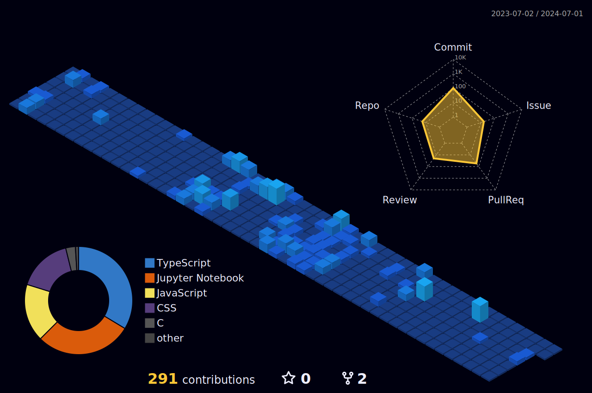

<!-- Description about me -->
<h1 align="center"> About me 👨‍💻 </h1>

Hola Amigos!  
I am <b>Aishika Nandi</b> pursuing B.Tech in CS from IIT Bhilai  
I am a proud <strong>Indian 🇮🇳</strong> 
I love to learn new technologies for betterment of existing automation 🚀 
Enjoy being a monotonic person 😬  
I spend my time discovering interesting open source projects online 👨‍💻 
Did I hear collaboration? Why not! Contact me for more info.
   

<!-- Social icons section -->
  

    
<!--      -->
    
    
  

<!-- languajes and skills section -->

<h1 align="center"> Technologies I know: </h1>

  <code></code>
  <code></code>
  <code></code>
  <code></code>
  <code></code>
  <code></code>
  <code></code>
  <code></code>
  <code></code>
  <code></code>
  <code></code>
  <code></code>
  <code></code>
  <code></code>
  <code></code>
  <code></code>
  <code></code>
  <code></code>
  <code></code>
  <code></code>
  <code></code>
  <code></code>
  <code></code>
  <code></code>
  <code></code>

 

<h1 align="center"> Technologies I'm learning: </h1>

  <code></code>
  <code></code>
  <code></code>
  <code></code>
  <code></code>
  <code></code>

 

<h1 align="center"> Environments I work with: </h1>

  <code></code>
  <code></code>
  <code></code>
  <code></code>

 

<!-- GitHub stats section -->

## 📊 Github stats

<!-- Bassed on: https://github.com/anuraghazra/github-readme-stats -->

   
  
  
   
  <b>Note:</b> Top languages is only a metric of the languages my public code consists of and doesn't reflect experience or skill level.

<!-- Projects section -->

## 📘 My top open source projects

<!-- Bassed on: Repo info cards - https://github.com/anuraghazra/github-readme-stats -->

  

    
    
  

  
&#8192;

  

    
    
  

&#8192;

&#8192;

  

<!-- last activity section -->

## Activity Graph

  

 

<!-- last refresh of readme section -->

Last refresh: <b>Monday, March 11, 7:16 AM GMT-5</b>

<!---
DavidsDvm/DavidsDvm is a ✨ special ✨ repository because its `README.md` (this file) appears on your GitHub profile.
You can click the Preview link to take a look at your changes.
--->
